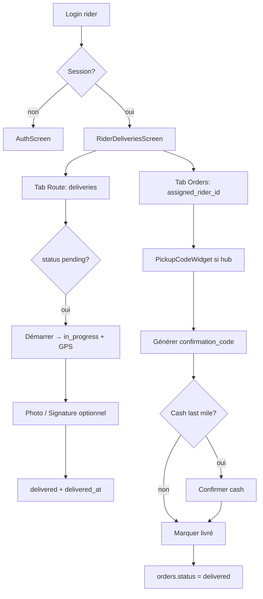
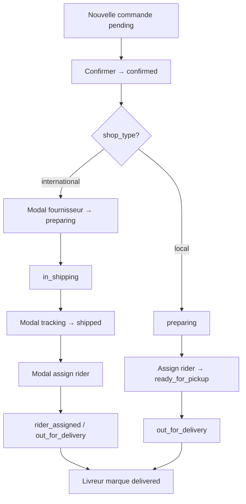

# Zandofy Flutter — Parcours UI Vendeurs et Livreurs

> Source : `VendorDashboardPage.tsx`, `VendorProductManager.tsx`, `VendorOrderManager.tsx`, `OrderTransitionModals.tsx`, `RiderDashboardPage.tsx`, composants `rider/*`, `vendor/*`, `MobileAccountMenu.tsx`.
> **App mobile unique** : FR principal, EN secondaire (voir `04_internationalisation.md`).

---

## 1. Architecture navigation par rôle

### 1.1 Routage au lancement (`main.dart`)

Séquence identique au web (`useAuth` + `useRoles`) :

1. `Supabase.instance.client.auth.currentSession` — session existante ?
2. Si non → écran Auth (`/auth`).
3. Si oui → `get_user_roles(userId)` ou `user_roles.select`.
4. Redirection selon persona (avec gestion multi-rôles — voir fichier 05).

```
main() → AuthGate
  ├─ loading → splash
  ├─ !session → AuthScreen
  └─ session → RoleResolver
        ├─ client    → ShopHomeScreen
        ├─ vendor    → VendorDashboardScreen
        ├─ rider     → RiderDeliveriesScreen
        └─ admin/manager → StaffWebOnlyScreen (lien vers zandofy.com/admin)
```

### 1.2 Accès croisé (utilisateur multi-rôle)

Sur le web, `MobileAccountMenu` affiche des liens vers chaque espace selon les rôles. Flutter v1 :

- **Drawer / menu compte** : entrées « Espace vendeur » / « Espace livreur » si les rôles existent.
- Mémoriser le mode actif (`vendor` | `rider` | `client`) en local.

Routes web de référence :

| Rôle | Route web |
|------|-----------|
| Vendeur | `/vendor` |
| Livreur | `/rider` |
| Client | `/`, `/dashboard`, `/account` |

---

## 2. Parcours Vendeur

### 2.1 Accès à l’espace vendeur

**Web aujourd’hui :**

1. Login (`/auth`).
2. Vérification rôle `vendor` dans `user_roles` (ou owner d’un `stores`).
3. Navigation `/vendor` ou lien « Espace Vendeur » dans `MobileAccountMenu`.
4. `VendorDashboardPage` charge les boutiques `stores` où `owner_id = user.id`.
5. Si aucune boutique → état `noStore` (devenir vendeur `/become-vendor`).

**Flutter :**

- `VendorDashboardScreen` = hub avec bottom navigation ou tabs (sous-set mobile).
- Charger `stores` au init ; `VendorStoreSwitcher` si plusieurs boutiques.

### 2.2 Onglets dashboard vendeur (web → priorité mobile)

| Onglet web (`activeTab`) | Composant | Priorité Flutter v1 |
|--------------------------|-----------|-------------------|
| `catalogue` | `VendorProductManager` | **P0** |
| `orders` | `VendorOrderManager` | **P0** |
| `messages` | `InternalChat` | P1 |
| `deliveries` | `VendorRiderTracking` | P1 |
| `wallet` | `VendorWalletTab` | P2 |
| `returns` / `disputes` | `VendorReturnsTab`, `VendorDisputesTab` | P2 |
| `stats`, `analytics_pro` | Stats | P2 |
| `promos`, `coupons` | Promotions | P3 |
| `team`, `suppliers`, `kyb`, etc. | Avancé | Web ou v2 |

### 2.3 Flux : ajouter un article (catalogue)

**Point d’entrée :** onglet Catalogue → bouton « Ajouter » (`VendorProductManager`).

**Étapes utilisateur :**

1. **Ouvrir le formulaire création** (`creating = true`) — formulaire plein écran (mobile-friendly sur web).
2. **Champs obligatoires** : `name_fr`, `price > 0`.
3. **Champs recommandés** : description, catégorie, images, stock (`stock_quantity` via variants), dimensions (shipping).
4. **Upload médias** (`MediaUploader`) :
   - Compression image (`compressImage`) avant upload.
   - Upload Storage bucket `product-media` → URL publique.
   - Image principale + médias variation.
5. **Variantes** (`ProductVariantsEditor`) : tailles, couleurs, variantes dynamiques.
6. **Calcul prix** (`PricingCalculator`) : coût, marge — optionnel.
7. **Sauvegarder** (`handleSave`) :
   - Génère `slug` via `generateProductSlug(name_fr)`.
   - `products.insert` avec `store_id`, payload complet.
   - Sync `product_images`, `product_sizes`, `product_colors`, variant tables.
   - Nouveau produit : statut DB par défaut souvent `draft` ; soumission modération séparée.
8. **Soumettre pour publication** :
   - Action « Soumettre » → `publish_status = 'pending_approval'`.
   - Admin approuve → `published` (visible catalogue client).

**Édition produit publié :** toute modification → `pending_approval` (re-modération).

**Flutter — écrans à construire :**

| Écran | Contenu |
|-------|---------|
| `VendorProductListScreen` | Liste + filtres statut (`draft`, `pending_approval`, `published`) |
| `VendorProductFormScreen` | Formulaire stepper ou sections scrollables |
| `VendorMediaPicker` | Camera + gallery → upload `product-media` |
| `VendorVariantsEditor` | Tailles / couleurs simplifiés v1 |

**Composants web à adapter :**

- `MediaUploader` → `image_picker` + `supabase_flutter` storage
- `CountryCombobox` → searchable dropdown
- `ProductVariantsEditor` → widgets liste éditable
- `PromotionTimer` → optionnel v1

### 2.4 Flux : valider / traiter une commande reçue

**Point d’entrée :** onglet Commandes (`VendorOrderManager`).

**Chargement :**

1. `orders` filtré `store_id`, avec `order_items`, `order_status_history`.
2. Filtres UI : statut, recherche (ref, client, ville, tracking…).

**Flux happy-path international :**

| Étape | Statut actuel | Action vendeur | Données supplémentaires |
|-------|---------------|----------------|-------------------------|
| 1 | `pending` | Confirmer | → `confirmed` |
| 2 | `confirmed` | Préparer | Modal **fournisseur** (`SupplierInfoModal`) → `preparing` |
| 3 | `preparing` | Expédier | → `in_shipping` |
| 4 | `in_shipping` | Arrivée hub | Modal **tracking** (`ShippedTransitionModal`) → `shipped` |
| 5 | `shipped` | Assigner livreur | Modal **rider** (`RiderAssignmentModal`) → `assigning_rider` / `rider_assigned` |

**Flux happy-path local (`shop_type = local`) :**

| Étape | Statut | Action |
|-------|--------|--------|
| 1 | `pending` | → `confirmed` |
| 2 | `confirmed` | → `preparing` |
| 3 | `preparing` | Assigner livreur → `ready_for_pickup` |
| 4 | `ready_for_pickup` | → `out_for_delivery` |
| 5 | `out_for_delivery` | (livreur / système) → `delivered` |

**Implémentation technique (`handleAdvance`) :**

- `getNextStatus(currentStatus, shopType)` depuis `order-status.ts`.
- `orders.update({ status: newStatus, ...extraFields })`.
- `triggerOrderStatusNotification` — notifications client.
- Historique auto via trigger DB sur `order_status_history` (si configuré).

**Modales bloquantes (international) :**

- `SupplierInfoModal` — numéro commande fournisseur.
- `ShippedTransitionModal` — `tracking_number`, preuve hub.
- `RiderAssignmentModal` — `assigned_rider_id`, `assigned_rider_name`.
- `DeliveryFeeModal`, `HubPickupModal` — cas hub / last mile.
- `EditTrackingModal` — correction tracking.

**Flutter v1 minimum :**

- Liste commandes expandable (items, client, total).
- Bouton **« Avancer le statut »** avec label du statut suivant (`STATUS_CONFIG`).
- Modales simplifiées pour champs requis (tracking, assignation livreur).
- Badge statut coloré (reprendre tokens `01_design_system_et_da.md`).

**Composants web à adapter :**

- `VendorOrderManager` — tableau + expansion + actions
- `OrderTransitionModals` — dialogs formulaire
- `PaymentProofUpload` — upload preuve paiement off-platform
- `ShippingLabelPreview` — PDF / impression (web ou share v2)
- `FreightDetailsPanel` — fret international (P2)

### 2.5 Autres actions vendeur (référence)

- **Suivi livreur** (`VendorRiderTracking`) : lecture `deliveries` + map `rider_locations`.
- **Chat client** (`InternalChat`) : conversations liées produit.
- **Wallet** (`VendorWalletTab`) : `vendor_wallets`, `vendor_transactions`.
- **Paramètres boutique** : logo, WhatsApp, zones — onglet `settings` dans `VendorDashboardPage`.

---

## 3. Parcours Livreur

### 3.1 Accès à l’espace livreur

**Web :**

1. Login + rôle `rider` dans `user_roles` (admin peut aussi accéder pour debug).
2. Route `/rider` — `RiderDashboardPage`.
3. Sans rôle → message « Accès Livreur requis » + lien accueil.

**Flutter :** `RiderDeliveriesScreen` = point d’entrée après `RoleResolver`.

### 3.2 Structure UI livreur (web)

Bottom navigation / tabs :

| Tab | Contenu |
|-----|---------|
| `route` | Courses `deliveries` en attente — liste + actions |
| `orders` | Commandes `orders` où `assigned_rider_id = me` |
| `map` | Carte GPS (`DeliveryMap`, `RiderMapTabContent`) |
| `history` | Historique `deliveries` livrées |
| `profile` | Stats, gains, avis (`rider_ratings`) |

Header : indicateur GPS actif / inactif, progression journée.

### 3.3 Flux A — Courses table `deliveries`

**Voir les colis à livrer :**

```sql
-- RLS applique rider_id = auth.uid()
SELECT * FROM deliveries
ORDER BY delivery_date DESC;
```

UI : onglet **Route** — liste `pending` + `in_progress`, tri par date.

**Carte course :** client, adresse, téléphone, `order_ref`, montant, nombre d’articles.

**Changer le statut :**

| Action UI | Update DB |
|-----------|-----------|
| « Démarrer » | `status = 'in_progress'` + GPS broadcast (`useRiderLocationBroadcast`) |
| « Livré » (avec preuves) | `status = 'delivered'`, `delivered_at` |
| Photo preuve | Upload `delivery-proofs/photos/` → `proof_photo_url` |
| Signature | Canvas → PNG → `delivery-proofs/signatures/` → `signature_url` |

**Composants web :**

- `PhotoCapture` — prise photo mobile
- `SignatureCanvas` — signature tactile
- Boutons touch `active:scale-95 touch-manipulation`

### 3.4 Flux B — Commandes assignées (`orders`)

**Voir les commandes :**

```sql
SELECT ... FROM orders
WHERE assigned_rider_id = auth.uid()
ORDER BY updated_at DESC;
```

UI : onglet **Commandes** — `activeOrders` vs `deliveredOrders`.

**Scénario hub → client (last mile) :**

1. Commande en statut hub (`arrived_at_hub`, `ready_for_pickup`, `at_hub`).
2. **Code de retrait hub** : `PickupCodeWidget` mode `rider` — scan / saisie code remise vendeur/hub → livreur.
3. Livraison à domicile :
   - Générer `confirmation_code` (`generateConfirmationCode` 6 chiffres) si absent.
   - Si paiement cash last mile : bouton **« Confirmer paiement cash »** → `rider_cash_collected = true`, `last_mile_payment_status = 'paid_cash'`.
   - Bouton **« Marquer comme livré »** → `status = 'delivered'` (bloqué si cash non confirmé).

**Scénario carte / GPS :**

- Onglet Map : position livreur + destination + GPS client (Realtime `rider_locations` / subscription client).
- Bouton « Demander position client » → insert `notifications` pour le client.
- Lien Google Maps navigation externe.

**Chat :** `DeliveryChat` pendant livraison active.

### 3.5 Synthèse statuts « Livré »

| Source | Condition | Update |
|--------|-----------|--------|
| `deliveries` | Course en cours | `deliveries.status = 'delivered'` + preuves optionnelles |
| `orders` | `confirmation_code` présent, cash OK si besoin | `orders.status = 'delivered'` |

Les deux flux peuvent coexister pour une même commande si admin a créé une ligne `deliveries` liée à `order_id`.

### 3.6 Flutter — écrans livreur v1

| Écran | Fonction |
|-------|----------|
| `RiderDeliveriesListScreen` | Liste `deliveries` pending/in_progress |
| `RiderDeliveryDetailScreen` | Détail + CTA Démarrer / Livrer |
| `RiderOrdersListScreen` | Commandes assignées |
| `RiderOrderDetailScreen` | Code hub, cash, confirmation, livré |
| `RiderMapScreen` | `google_maps_flutter` + geolocator |
| `RiderProofCaptureScreen` | Camera + signature pad |
| `RiderProfileScreen` | Gains, avis, historique |

**Permissions natives :** GPS (foreground + background si tracking), caméra, stockage photos.

---

## 4. Composants UI spécifiques — inventaire adaptation mobile

### 4.1 Vendeur

| Composant web | Fichier | Adaptation Flutter |
|---------------|---------|-------------------|
| Dashboard hub | `VendorDashboardPage` | `Scaffold` + `NavigationBar` (3–5 onglets) |
| Switch boutique | `VendorStoreSwitcher` | `DropdownButton` / drawer |
| Gestion produits | `VendorProductManager` | Liste + formulaire plein écran |
| Upload média | `MediaUploader` | `image_picker` + compression |
| Variantes | `ProductVariantsEditor` | List tiles éditables |
| Commandes | `VendorOrderManager` | `ListView` + `ExpansionTile` |
| Modales statut | `OrderTransitionModals` | `showModalBottomSheet` / dialogs |
| Suivi livreur | `VendorRiderTracking` | Map + liste statuts |
| Chat | `InternalChat` | Stream messages Supabase |
| Bannière suspension | inline `VendorDashboardPage` | `Banner` alert |
| Tier / limites | `useVendorSubscription` | Badge + gate « ajouter produit » |

### 4.2 Livreur

| Composant web | Fichier | Adaptation Flutter |
|---------------|---------|-------------------|
| Dashboard | `RiderDashboardPage` | Tab scaffold + safe area |
| Photo preuve | `PhotoCapture` | `camera` / `image_picker` |
| Signature | `SignatureCanvas` | `signature` package |
| Carte | `DeliveryMap` | `google_maps_flutter` |
| GPS broadcast | `useRiderLocationBroadcast` | `geolocator` + periodic upsert |
| Code retrait | `PickupCodeWidget` | Text field + validation RPC/API |
| Chat livraison | `DeliveryChat` | Messages realtime |
| Notation | `RiderRatingModal` | Modal post-livraison (côté client) |

### 4.3 Partagés (tous rôles)

| Composant | Usage |
|-----------|--------|
| `MobileAccountMenu` | Menu compte + liens rôles |
| `RoleGuard` | Guard routes par rôle |
| `Header` / bottom nav client | Client shell quand persona = client |
| `toast` / `sonner` | `SnackBar` ou overlay |
| `STATUS_CONFIG` | Labels FR statuts — dupliquer en ARB |

---

## 5. Internationalisation (FR / EN)

Clés existantes web (`I18nContext`) :

- `account.role.vendor`, `account.role.rider`, `account.role.shipper` (ne pas utiliser shipper pour livreur)
- Statuts commande : labels dans `order-status.ts` (FR) — ajouter EN dans ARB Flutter
- Messages toast vendeur/livreur : reprendre ou traduire

**Règle affichage :** FR par défaut ; EN si locale utilisateur = `en`.

---

## 6. Intégration avec les 5 autres specs Flutter

| Fichier | Lien avec vendeur/livreur |
|---------|---------------------------|
| `01_design_system_et_da.md` | Tokens, cards, boutons statut |
| `02_supabase_schema_clients.md` | Tables `orders`, `products` partagées |
| `03_parcours_utilisateur_client.md` | Même user peut être client + vendeur |
| `04_internationalisation.md` | ARB, `formatPrice` |
| `05_roles_vendeurs_et_livreurs_supabase.md` | Rôles, tables, RLS |

**Ordre implémentation suggéré :**

1. Auth + `RoleResolver` + shells vides par persona.
2. Livreur P0 (liste + marquer livré) — flux opérationnel terrain.
3. Vendeur P0 (liste commandes + avancer statut + liste produits).
4. Vendeur P1 (création produit + images).
5. Maps, chat, wallet — P2.

---

## 7. Diagramme flux livreur (résumé)



---

## 8. Diagramme flux vendeur — nouvelle commande


