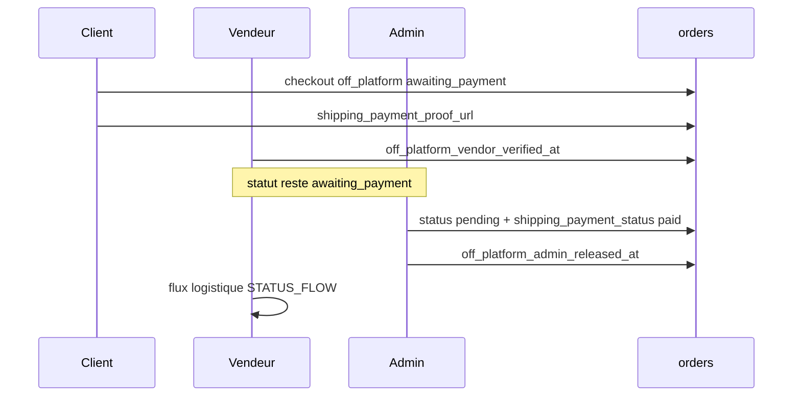

# Paiement hors plateforme (`off_platform`)

## Parcours client

1. Checkout avec mode **Paiement hors plateforme**.
2. Commande créée en statut `awaiting_payment`.
3. Client paie le vendeur hors site (Mobile Money, virement, etc.).
4. Client uploade la preuve depuis **Dashboard** → détail commande.

## Double validation (vendeur puis admin)

| Étape | Acteur | Action | Statut |
|-------|--------|--------|--------|
| 1 | Client | Upload preuve | `awaiting_payment` |
| 2 | Vendeur | Valide la preuve client | `awaiting_payment` + `off_platform_vendor_verified_at` |
| 3 | Admin | Libère la commande | `pending` + `shipping_payment_status: paid` |
| Refus | Vendeur ou admin | Paiement refusé | `payment_failed` |

L’admin peut **libérer sans validation vendeur** (override) si preuve présente — réservé aux litiges ; une entrée est ajoutée dans `order_status_history`.

Les commandes **carte / Mobile Money** en `awaiting_payment` restent **invisibles** chez le vendeur.

## Stockage fichier

- Bucket : `delivery-proofs` (privé)
- Chemin : `payment-proofs/{order_id}/{field}-{timestamp}.jpg`
- RLS : migration `20260523120000_payment_proof_storage_rls.sql`

## Colonnes base de données

| Colonne | Rôle |
|---------|------|
| `shipping_payment_proof_url` | Preuve paiement produit (nom historique) |
| `off_platform_vendor_verified_at` | Horodatage validation vendeur |
| `off_platform_vendor_verified_by` | UUID vendeur validateur |
| `off_platform_admin_released_at` | Horodatage libération admin |
| `off_platform_admin_released_by` | UUID admin libérateur |

Migration : `20260524120000_off_platform_dual_validation.sql`

| Situation ultérieure | Colonne |
|----------------------|---------|
| Preuve frais **expédition** | `shipping_payment_proof_url` (après validation produit) |
| Preuve **last mile** | `last_mile_payment_proof_url` |
| Photo **hub** vendeur | `hub_pickup_proof_url` |

## Interfaces

- **Vendeur** : `VendorOrderManager` — filtre PostgREST `VENDOR_ORDERS_OR_FILTER`, panneau « Valider la preuve client ».
- **Admin** : `AdminOrdersPage` — onglet « Hors plateforme (N) », `OffPlatformReleasePanel`.

## Déploiement

1. Appliquer `20260523120000_payment_proof_storage_rls.sql` (staging puis prod).
2. Appliquer `20260524120000_off_platform_dual_validation.sql` (staging puis prod).
3. Déployer le frontend.

Checklist staging : voir [PAYMENT_PROOF_DEPLOYMENT.md](PAYMENT_PROOF_DEPLOYMENT.md).
